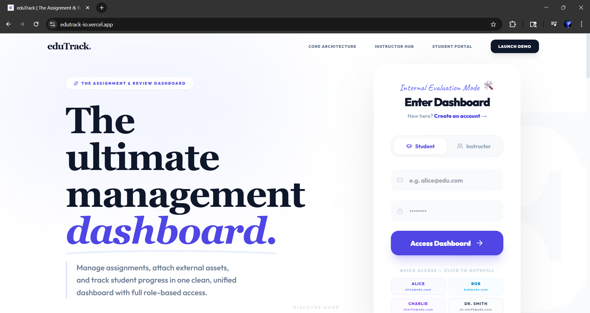
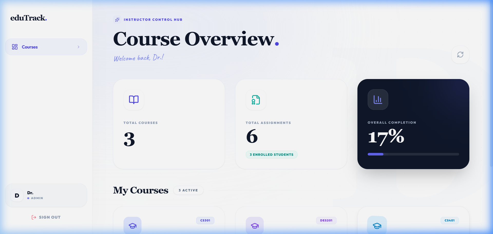
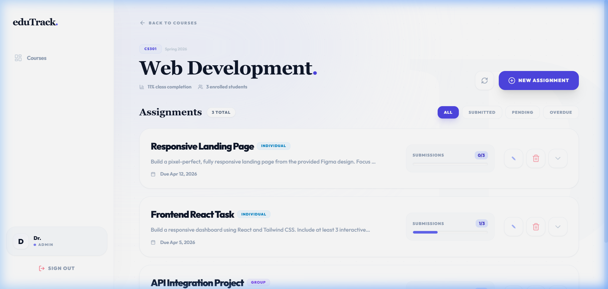
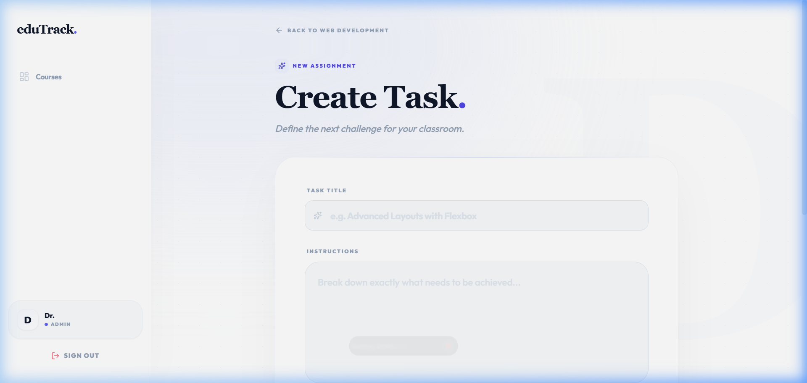
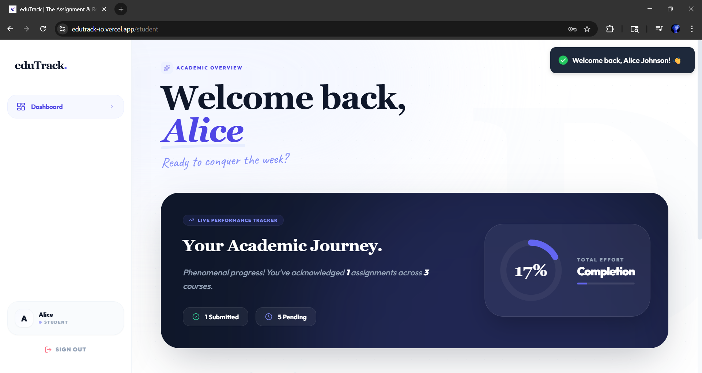
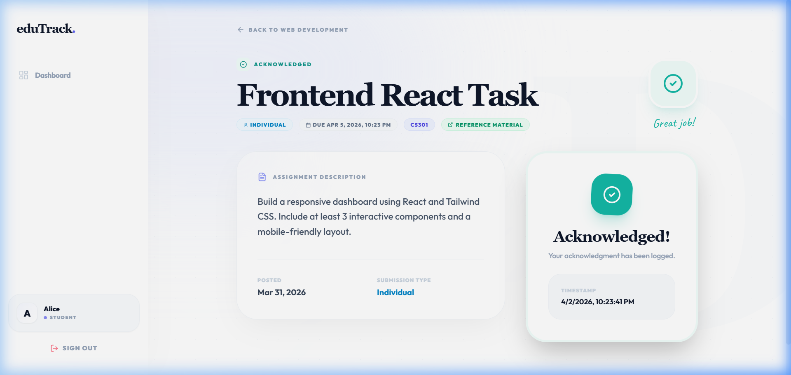
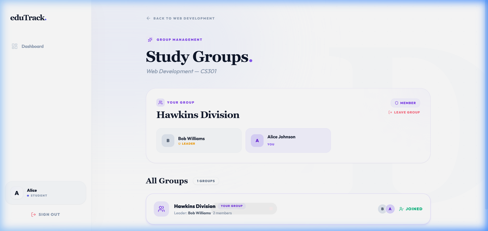

# eduTrack. — Assignment & Review Dashboard

A fully responsive, role-based assignment management platform built with **React.js + Tailwind CSS**. Supports complete Professor and Student workflows including group management, acknowledgment flows, and real-time progress analytics — all powered by a simulated backend via `localStorage`.

---

## 🚀 Live Demo

🔗 **[Live App →](https://edutrack-assignments-dashboard.vercel.app)**

### Demo Credentials

| Role | Email | Password |
|---|---|---|
| Instructor | `dr.smith@edu.com` | `pass` |
| Student (Alice) | `alice@edu.com` | `pass` |
| Student (Bob) | `bob@edu.com` | `pass` |
| Student (Charlie) | `charlie@edu.com` | `pass` |

> Use the **Quick Access buttons** on the login page to auto-fill and sign in instantly.

---

## ✨ Features

### 🎓 Professor Flow
- **Login / Register** with role-based redirect to Instructor Hub
- **Course Dashboard** — all taught courses with completion analytics
- **Assignment Management** per course:
  - Create, Edit, Delete assignments
  - Fields: Title, Description, Deadline, OneDrive/Submission Link, Submission Type (Group / Individual)
  - **Submission tracking** — see exactly which students have submitted with timestamps
  - **Filter tabs**: All / Submitted / Pending / Overdue
  - Per-assignment progress bars with per-student breakdown

### 🎒 Student Flow
- **Login / Register** with role-based redirect to Student Portal
- **Course Hub** — all enrolled courses with per-course completion progress
- **Assignment Page** per course:
  - Displays: Name, Description, Deadline, OneDrive Link, Submission Type, Acknowledgment Status
  - **Individual assignments**: every student must personally acknowledge ("Yes, I have submitted")
  - **Group assignments**: only the Group Leader can acknowledge — all group members are automatically marked as submitted
  - **"No group" prompt**: displays a join/create group CTA if student is ungrouped for a group assignment
- **Group Management**: create groups, join existing ones, view group members and leader

### 🎨 UI/UX Highlights
- Framer Motion animations throughout
- Toast notifications for every action
- 2-step confirmation modals for destructive actions
- Hover states, micro-animations, animated progress bars
- Responsive across all devices — iPhone SE to 4K desktop

---

## 🛠️ Tech Stack

| Layer | Technology |
|---|---|
| Framework | React 18 + Vite |
| Styling | Tailwind CSS v3 |
| Routing | React Router v7 |
| Animations | Framer Motion |
| Icons | Lucide React |
| Notifications | React Hot Toast |
| Data Layer | Browser `localStorage` (simulated backend) |
| Fonts | Google Fonts — Outfit, Playfair Display |

---

## ⚙️ Setup Instructions

### Prerequisites
- Node.js ≥ 18
- npm ≥ 9

### Run Locally

```bash
# 1. Clone the repo
git clone https://github.com/your-username/edutrack-dashboard.git
cd edutrack-dashboard

# 2. Install dependencies
npm install

# 3. Start the dev server
npm run dev
```

Open **http://localhost:5173** in your browser.

> No backend or environment variables required.  
> All data is automatically seeded into `localStorage` on first load.

### Build for Production

```bash
npm run build
# Output → /dist — deploy this folder to Netlify or Vercel
```

---

## 🎨 Frontend Design Choices

### Visual Language
- **"Crystal Light" design system** — white cards, indigo accent colour, subtle dot-grid backgrounds, glassmorphism on the login page
- **Serif typography** (Playfair Display) for all headings — conveys an academic, premium feel
- **Sans-serif body** (Outfit) — modern and highly readable for UI text
- Consistent large border-radius (`rounded-[28px]`, `rounded-[32px]`) across all cards and inputs

### Interaction & Animation
- **Framer Motion** powers all page transitions, card entrances, and modal animations
- Progress bars animate in on mount (`initial: 0% → animate: X%`)
- All destructive actions use a **2-step confirmation modal**
- Every state change triggers a **toast notification** — success, error, or info
- Cards lift on hover, buttons scale on tap — consistent micro-interaction language

### Role-Based UX
- A single login page auto-detects role from credentials — no manual role selection
- Instructors land on a **Course Hub** with per-course analytics
- Students land on a **Course Hub** with per-course progress rings
- `PrivateRoute` guards ensure students can never access instructor pages and vice versa

### Session Persistence
- User session is saved to `localStorage` — refreshing the page or navigating between routes does **not** log you out
- `AuthContext` uses a synchronous lazy initializer to restore session before the first render, preventing any flash-redirect to the login page

### Responsiveness
- **Mobile** (< 640px): stacked layout, floating bottom navigation bar
- **Tablet** (768px+): sidebar appears, grid expands to 2 columns
- **Desktop** (1280px+): full split-screen login, 3-column course grids

---

## 📸 Screenshots — UI Flow

### Login Page


### Instructor — Course Hub


### Instructor — Assignment Management


### Create Assignment Form


### Student — Course Hub


### Student — Assignment Details & Acknowledgment


### Group Management


---

## 🗂️ Component Structure

```
src/
├── context/
│   └── AuthContext.jsx           # Global auth state + session persistence
│
├── utils/
│   └── localStorage.js           # Simulated DB — seed data + CRUD helpers
│
├── pages/
│   ├── Login.jsx                 # Landing page + sign-in form
│   ├── Register.jsx              # Sign-up form with role selection
│   │
│   ├── admin/
│   │   ├── AdminDashboard.jsx    # Instructor course hub + overall analytics
│   │   ├── CourseAssignments.jsx # Per-course assignment list, filters, student breakdown
│   │   └── CreateAssignment.jsx  # Create / Edit assignment form
│   │
│   └── student/
│       ├── StudentDashboard.jsx  # Student course hub + completion progress rings
│       ├── CourseAssignments.jsx # Per-course assignment list with status filters
│       ├── AssignmentDetails.jsx # Assignment view + individual/group acknowledgment flow
│       └── GroupManagement.jsx   # Create, join, and manage course groups
│
├── components/
│   └── layout/
│       └── DashboardLayout.jsx   # Sidebar, breadcrumb nav, mobile bottom nav
│
└── App.jsx                       # Route definitions + PrivateRoute role guard
```

---

## 🔐 Data Schema

All data lives in the browser's `localStorage`:

```js
users:       [{ id, name, email, password, role }]
courses:     [{ id, name, code, adminId, semester, color }]
assignments: [{ id, title, description, dueDate, driveLink, submissionType, courseId, createdBy }]
submissions: [{ id, assignmentId, studentId, status, acknowledged, acknowledgedAt, acknowledgedBy }]
groups:      [{ id, courseId, name, leaderId, memberIds[] }]
```

> In production this would be replaced with a **Node.js + Express** REST API connected to **MongoDB**, with JWT-based authentication stored in `httpOnly` cookies.

